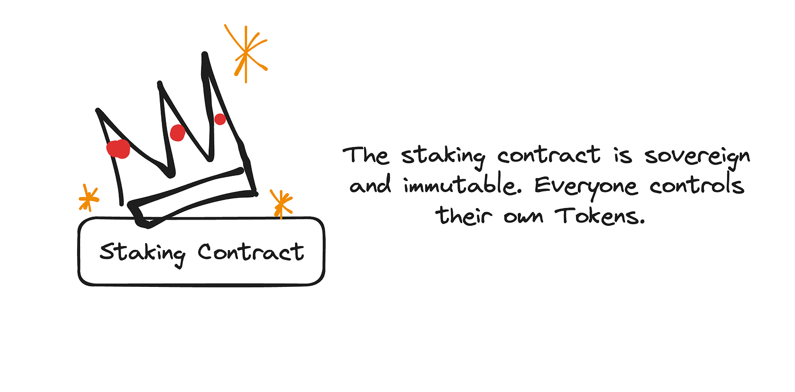
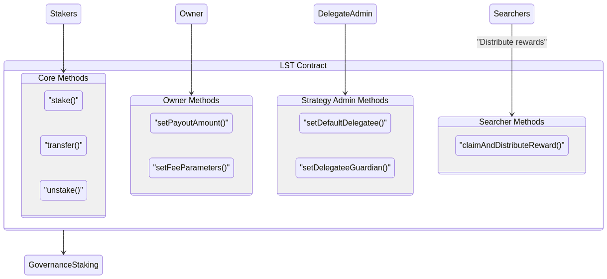

# 🏦 Staking on Tally

**Staker**\
The base layer of the Tally protocol is Staker, based on Uniswap's audited [UniStaker](https://github.com/uniswapfoundation/UniStaker). Staker works much like Uniswap's [Franchiser](https://github.com/NoahZinsmeister/franchiser) in that each pool of staked tokens are held in their own special purpose smart contract which can only delegate their voting power. The Staking contract is simple, permissionless, audited and has no special authorities. Optionally it can be deployed to be immutable, or upgradable directly by the DAO.

This means that the base layer staking is very safe. Each user owns their own staking vault, and is free to use staker regardless of whether or not they use the Tally Protocol. This allows for maximum flexibility for the DAO and lets others also build yield generating infrastructure for the DAO's Token.

Staker Explained 

This means that the base layer staking is very safe. Each user owns their own staking vault, and is free to use staker regardless of whether or not they use the Tally Protocol. This allows for maximum flexibility for the DAO and lets others also build yield generating infrastructure for the DAO's Token.

The Tally Protocol works by administering its own vault, not any other vault. The Tally protocol has no special powers over the staking contract, and has no access to users tokens other than the tokens it manages itself.

This is important because it allows other teams, like [@OpenDollar](https://forum.arbitrum.foundation/u/opendollar) to build their own applications on top of staker and pass on revenue to their users. OpenDollar already has sponsored [Delegate Vaults](https://build.opendollar.com/Delegate-Vaults-d11732aa9dd04ce6a240fcda575844a5) which allows OpenDollar protocol controlled DAO tokens to participate in governance. This would allow their protocol to also stake and pass revenue to OpenDollar. We think this is an effective model to help protocols build businesses.

The Tally Protocol

**Tally Protocol**

The protocol is a software convenience layer on top of staking designed to make the process of doing the work of selecting delegates (and holding them accountable!) easier for staker.\

Again, the Tally Protocol only manages it’s own staked token vault, no one elses.

What the Tally Protocol does that is special, is that it creates a _receipt token_ for the \[token] which is staked through it, called st\[token], and it returns it to the user.

The underlying tokens that the Tally Protocol have staked on the users behalf are _always_ available to redeem, 1:1 plus rewards, at any time, with no delay or lockup.

This is a very important point. The st\[token] receipt is functionally equivalent to the underlying token, it can be exchanged at any time. Because of this, there is no risk of a depeg event for the st\[token]:\[token] exchange rate. Any deviation from a 1:1 exchange rate would be instantly arbitraged by 3rd parties staking or unstaking st\[token]:\[token] to capture any deviation in the exchange rate.

**Of course this means we need to be **_**very**_** sure that you can always redeem 1:1. To be sure of this we’re doing several things:**

Simplicity 

One of the most powerful tools in security is simplicity. The Tally Protocol itself is very simple, and the contract which manages the token is essentially just a wrapper contract that deposits the DAO \[token] into staker and mints st\[token], or takes in st\[token], and returns \[token].

The contract is easy to reason about, easy to test, and intentionally designed to be very simple.

To address some of your specific questions:

1. **Misalignment Risk: The ratio of unlocked tokens to quorum requirements may become imbalanced, potentially making governance decisions either too easy (if quorum is too low relative to supply) or too difficult (if quorum is too high).**

There is no danger of misalignment risk in the protocol as there are no locked tokens.

Holders of st\[token] have all the same governance rights as \[token] holders and the two tokens are effectively identical (except the fact that st\[token]'s also earn auto-compounding yield). As there is no lockup period, users are free to move between the two tokens at any time, meaning there is effectively no change in _how_ the tokens interact with governance.

What we do hope happens however is that more token holders participate in governance. If that happens it might be worthwhile revisiting quorum requirements, but keep in mind this is a _feature_ not a bug. There is no leveraged voting power being created here, users are electing themselves to be more active in governance. The delegation strategies the DAO might elect to use in the Tally Protocol are no different than users choosing to delegate their tokens themselves.

Additionally, delegation strategies have no special powers that might present a danger. Token holders are free to change delegation strategies at any time. Poorly implemented delegation strategies do not pose a feedback loop danger, and in the absolute worst case scenario users simply withdraw their tokens, or delegate to themselves.

In essence, the Tally Protocol does not introduce any new variables to the game theory of how DAO governance currently operates. All the expectations we hold to be true in vanilla DAO governance and hold true with the Tally Protocol as a governance participant as well.

2. **Participation Gap: Even with increased staking, the growth in active participants may lag behind the growth in token supply, making it progressively harder to reach quorum over time.**

This is not a concern with either staker or Tally Protocol. All tokens in staking and Tally protocol must be delegated (this is not optional and is core to why staking works: users _must_ do effort to be rewarded such that they are rewarded specifically for their own efforts). This means that increase of tokens staking whether directly, or via the Tally protocol strictly results in an increase of delegated voting power.

In the implementation we are proposing for DAOs there are economic incentives to be sure the delegated voter is active as well.

This is actually _safer_ for DAOs and ensures that participation in the DAO is always high and grows as more token holders elect to use the staker or the protocol.

3. **Governance Efficacy: This potential misalignment could affect the DAO’s ability to make timely and representative decisions, especially if a significant portion of the growing token supply remains passive in governance.**

There are no passive tokens in the Tally Protocol or in staking as 100% of staked tokens, whether through the Tally protocol or directly via staker are at a minimum delegated. This means that the efficacy of the DAO is unchanged from today's status quo: either delegates vote or they don’t. The Tally protocol and staking don’t influence the commitment of our delegates to participate.

In the implementation we are specifically suggesting for DAOs there are also requirements that rewards be linked to _participation_, meaning there is a strong economic incentive to actively participate in governance for both the token holders and their delegate. Staking and the Tally Protocol will substantially work to significantly reduce passive holders and reward actives in the DAO.

Auditing

We will be doing many audits over the course of the lifetime of the Tally Protocol to ensure it’s safe. I myself (Dennison) was an early team member of OpenZeppelin and know how important security is. It’s a top priority.

