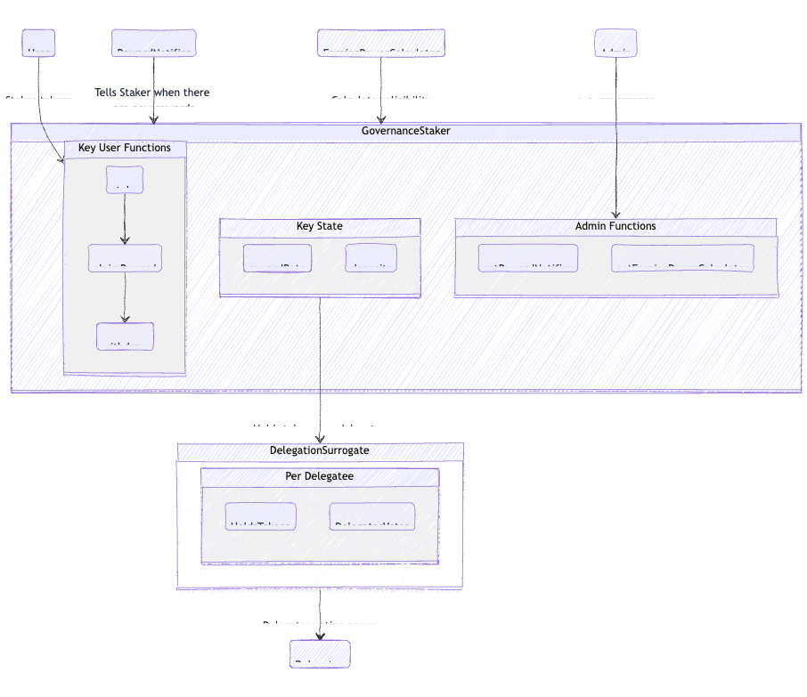

# Staker

Tally supports [Staker](https://github.com/withtally/staker), an industry-standard, extensible staking contract. Staker makes it easy to launch onchain staking rewards for any ERC20 token.

Uniswap, Arbitrum, Rari and other protocols plan to use Staker to distribute rewards. The rewards can optionally depend on eligibility criteria. e.g. requiring that staked tokens be active in governance.

### Why staking?

Staking rewards align holders with the protocol.

Staking is the crypto-native way to incentivize almost anything. It's the foundation for open, trust-minimized economic systems.

Staker also supports eligibility criteria, which lets protocol designers incentivize behavior from stakers. For example, staking users could only be eligible for rewards if they are also using the protocol.

### Why now?

It’s staking season! These days, token utility is not just possible, but expected. Staking aligns tokenholders and secures the protocol. Staker is backward compatible with governance and future-compatible with ambitious staking roadmaps.

### How does it work?

#### **1. Tokenholders stake**

Tokenholders can stake in a single token. Then, they earn a share of the rewards proportional to their share of all staked tokens over time. They can stake, claim rewards, and unstake at any time.

If the staked token is an ERC20Votes governance tokens, Staker supports governance. Tokenholders can delegate the voting power of their staked tokens. That way, tokenholders don't have to choose between governance and receiving rewards.

If holders need to choose between governance and yield, many will choose yield. That will undermine governance.

#### **2. Staker distributes rewards over time**

Rewards can come from anywhere. The most common sources are 1) protocol revenue and 2) issuance of the protocol's native token. The rewards can be in any ERC20 token or even in more than one token.

Staker distributes rewards among eligible staking users over time. Each staking user's reward is proportional to their staked balance over time.

The eligibility criteria can stipulate particular things from tokenholders to get rewards. For example, it could require that staked tokens be active in governance to earn rewards. There's a large design space here for incentivizing token-aligned services!

#### Admin functions

Staker is an immutable contract with minimal admin powers. It does have two admin functions:

* Adding new sources of reward. Each reward source has to be whitelisted by the admin to prevent spam and griefing.
* Changing the eligibility criteria

The admin of a Staker is usually the protocol's governance.

#### **Implementation details**

Here's an architecture diagram of the smart contracts:

<figure><figcaption></figcaption></figure>

* Governance Staking is out-of-the-box compatible with existing \`ERC20Votes\` governance tokens. It supports \`ERC20Votes\` delegation with the "surrogate factory" pattern. Governance Staking creates a surrogate contract for each delegate. It delegates voting power in each surrogate to the delegate.
* Whenever Governance Staking receives rewards, it distributes them over a period of time. Distributing over time gives unstaked tokenholders a chance to stake. A smooth schedule also minimizes discontinuities from flash staking.
* The Governance Staking contract builds on [UniStaker](https://github.com/uniswapfoundation/UniStaker). Unistaker is based on Syntheix's [StakingRewards](https://github.com/Synthetixio/synthetix/blob/develop/contracts/StakingRewards.sol).
* UniStaker and Staker were audited several times. The audit reports are [available here](https://github.com/withtally/staker/tree/main/audits/unistaker).

### Liquid token wrapper

Tally has also built an aligned liquid staking token for Staker. This LST automates claiming rewards and delegating governance power. It's like what stETH does for ETH staking.

Read more about the [stGOV LST](stgov-lst.md) here.

### Deploy Staker

Tally is working to make Staker easier to deploy. To work with us to deploy Staker for your protocol and get a staking user interface set up on Tally, reach out to [biz@tally.xyz](mailto:biz@tally.xyz).

If you'd like to deploy it or test it yourself, check out [the Staker repo here](https://github.com/withtally/staker).
