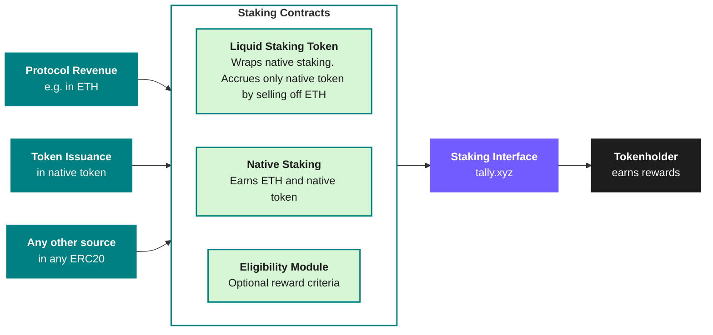

# Value Accrual with Staking

### Why Value Accrual?

Blockchain protocols need sustainable token economics and aligned holders to succeed.

Value accrual offers several key benefits:

* **Stakeholder alignment**: Align tokenholders with protocol success
* **Sustainable tokenomics**: Establish a foundation for ongoing value creation
* **Enhanced retention**: Encourage long-term participation in the ecosystem
* **Protocol resilience**: Secure the protocol with economic assets

Protocols must move beyond initial hype cycles. Value accrual mechanisms help by distributing value directly to participants who secure and govern the network.

### Why use Staking for Value Accrual?

Tally's value accrual product is a complete staking solution for protocols.&#x20;

Staking on Tally distributes protocol revenue or native issuance to tokenholders. It's the foundation for open, trust-minimized systems.

Optionally, the rewards can be incentives for particular actions. Rewards can depend on particular behavior, like validating the network, long-term holding or governance activity.

Tally staking offers:

1. **Flexible staking infrastructure**: Implement staking for your protocol’s specific needs.
2. [**Multiple reward sources**](https://docs.tally.xyz/tally-features/staking/staking-customizations#returning-fees): Distribute rewards from protocol revenue, treasury assets, token emissions, or all of the above!
3. [**Governance integration**](https://docs.tally.xyz/tally-features/staking/staking-customizations#governance-integration): Staking is compatible with governance, so that holders don’t have to choose between rewards and governance. Optionally, rewards can be conditional on active participation in governance.
4. [**Validator support**](https://docs.tally.xyz/tally-features/staking/staking-customizations#network-protocol-validation): Pay stakers and operators to validate protocol security.
5. [**Engagement mechanics**](https://docs.tally.xyz/tally-features/staking/staking-customizations#stake-streaks): Increase rewards for long-term alignment with stake streaks.\

Tally's solution works for protocols at any stage. It supports new token launches and established projects. This guide covers both strategic direction and technical details.&#x20;

Launch a new token with built-in utility, or enhance your existing tokenomics. Either way, Tally's product provides the foundation for sustainable economic alignment. Get in touch with our implementation and sales team to learn more: [tally.xyz/contact](https://www.tally.xyz/contact).

### How does it work?

**1. Staking contracts distribute rewards over time**

Rewards can come from anywhere. The most common sources are 1) protocol revenue and 2) issuance of the protocol's native token. The rewards can be in any ERC20 token or even in more than one token.

Tally's staking contracts distribute rewards among eligible staking users over time.&#x20;

**2. Tokenholders stake protocol tokens for a share of the rewards**

Tokenholders stake the staking token: the protocol's native token. Then, they earn a share of the rewards proportional to their share of all staked tokens over time. They can stake, claim rewards, and unstake at any time.

Staking supports governance. If the staking token is also a governance token, holders can use their staked tokens in governance. That way, tokenholders don't have to choose between governance and receiving rewards.

Optionally, the staking system can have eligibility criteria stipulate particular actions from tokenholders to get rewards. For example, it could require that staked tokens be active in governance to earn rewards. There's a large design space for incentivizing token-aligned services.

### Self-Serve Staking (Coming Soon)

While not yet available, teams should review the [Staking Contracts Guide](../../set-up-and-technical-documentation/staking-contracts/) to go in-depth on how staking works, how to set it up, and how to operate a staking system.&#x20;

For inquires, contact us [here](https://tally.xyz/contact).&#x20;

### Learn more


[staking-customizations.md](staking-customizations.md)



[faq.md](faq.md)



[staking-contracts](../../set-up-and-technical-documentation/staking-contracts/)



[glossary.md](glossary.md)

