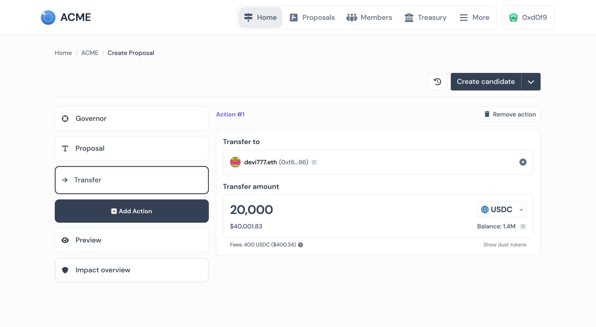

# Tally Fees

### Why does Tally charge a fee?&#x20;

Tally offers a wide range of product features for DAOs to power protocols, manage treasuries, distribute public goods, and more:

* Create, vote, & execute proposals&#x20;
* Manage & diversify treasuries with trustless, MEV-protected tokenswaps
* Elect onchain security councils to manage multisigs & grants programs
* Launch a DAO seamlessly with custom token claim flows, delegation discovery, & community building tools&#x20;

The 0.25% fee on proposal transfers creates revenue to enable Tally to continue to innovate & support the DAO ecosystem in the future. Fee revenue supports operational costs, maintenance, & product development as Tally maintains its commitment to the decentralized organizations.\
\
&#xNAN;_&#x44;AOs that have existing agreements with Tally are excluded._

### How does the fee work?&#x20;

Once a proposal is passed & executed onchain by the DAO, the 0.25% fee is automatically applied to the final transfer amount & sent to a Safe deployed on the respective chain . The fee amount is denominated in the transfer's native token amount. The USD value is also shown for convenience.  

<figure><figcaption></figcaption></figure>
